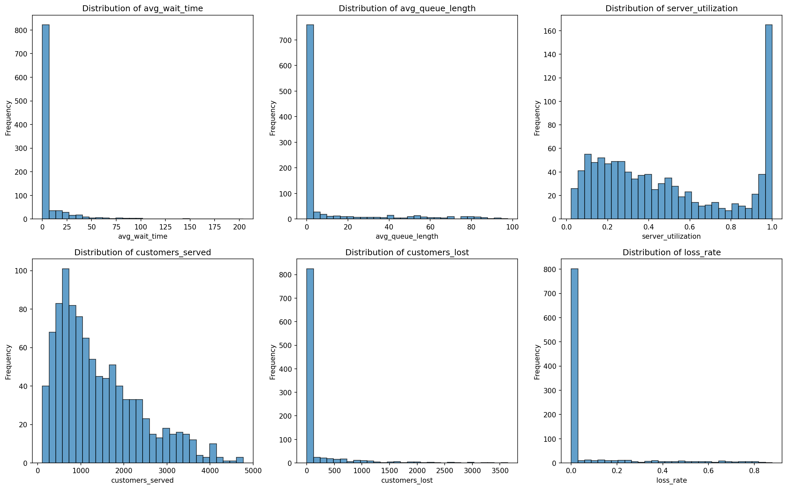
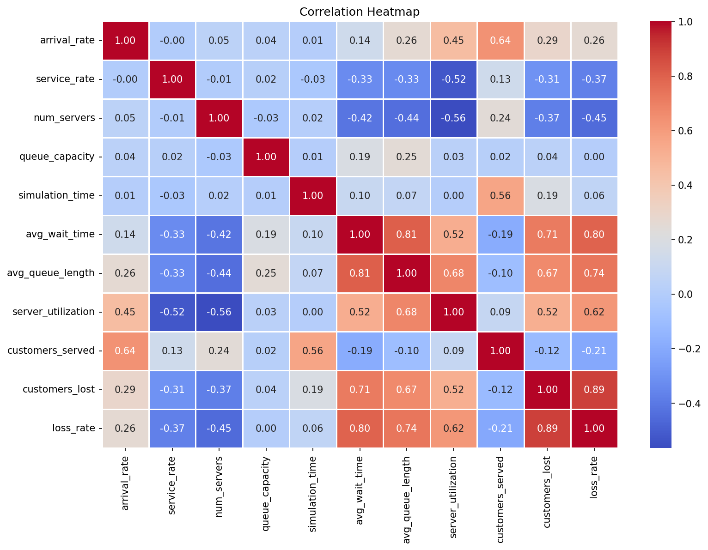
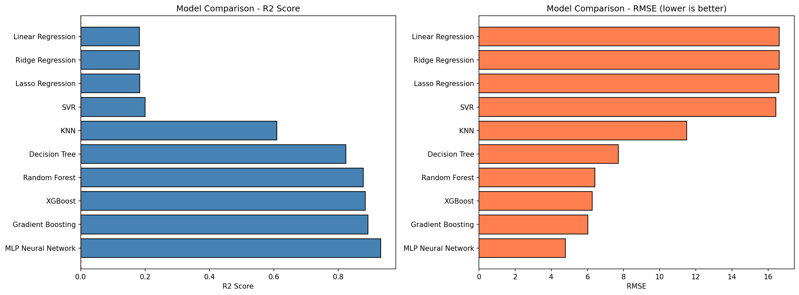
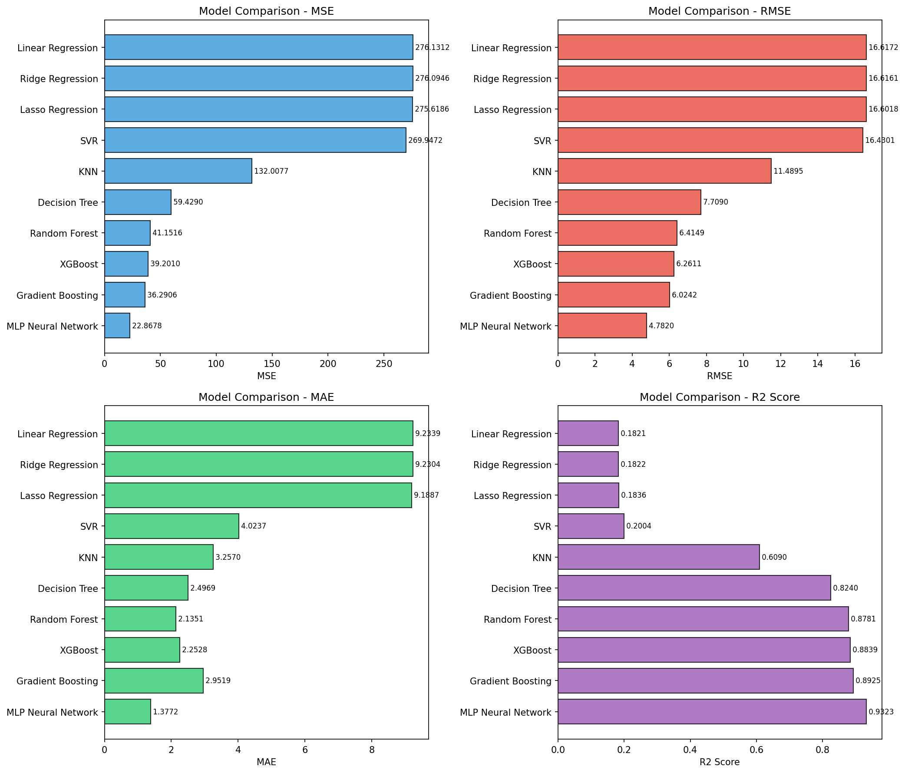
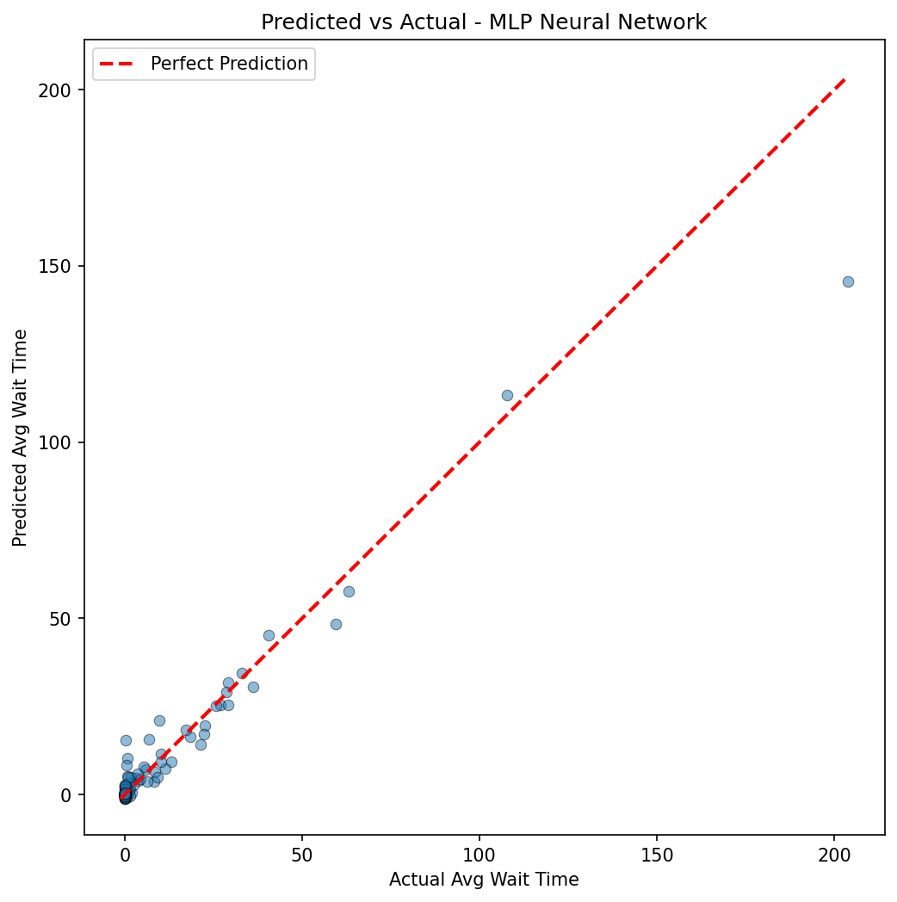
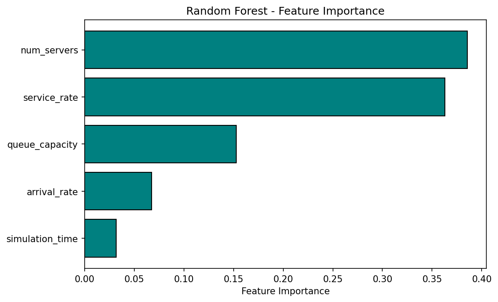

# Data Generation using Modelling and Simulation for Machine Learning

## 1. Simulation Tool

**SimPy** — A process-based discrete-event simulation library for Python.

- Documentation: https://simpy.readthedocs.io/
- Wikipedia: https://en.wikipedia.org/wiki/SimPy

SimPy allows modelling of real-world systems where events occur at discrete points in time (e.g., customer arrivals, server completions). It is lightweight, pure-Python, and well-suited for queuing, manufacturing, and network simulations.

---

## 2. Problem Description

We simulate a **multi-server queuing system** (M/M/c queue with finite capacity), modelling a real-world service center (bank, hospital, call center) where:

- Customers arrive following a **Poisson process** (exponential inter-arrival times)
- Multiple servers process customers **in parallel**
- A **finite queue** holds waiting customers; excess arrivals are **lost** (turned away)
- Service times follow an **exponential distribution**

The goal is to generate a synthetic dataset from 1000 simulation runs and then train ML models to predict the **average customer wait time** from the simulation input parameters.

---

## 3. Simulation Parameters and Bounds

| Parameter | Description | Lower Bound | Upper Bound | Type |
|-----------|-------------|:-----------:|:-----------:|:----:|
| `arrival_rate` | Mean customer arrivals per unit time | 0.5 | 5.0 | Continuous |
| `service_rate` | Mean customers served per unit time per server | 0.3 | 3.0 | Continuous |
| `num_servers` | Number of parallel servers | 1 | 10 | Integer |
| `queue_capacity` | Maximum number of customers allowed in queue | 5 | 100 | Integer |
| `simulation_time` | Total simulation duration (time units) | 200 | 1000 | Integer |

For each simulation run, parameters are sampled **uniformly at random** within these bounds.

---

## 4. Output Metrics (Recorded per Simulation)

| Metric | Description |
|--------|-------------|
| `avg_wait_time` | Average time a customer waits before being served |
| `avg_queue_length` | Average number of customers in the queue |
| `server_utilization` | Fraction of server capacity used (0 to 1) |
| `customers_served` | Total customers successfully served |
| `customers_lost` | Total customers turned away (queue full) |
| `loss_rate` | Fraction of total arrivals that were lost |

---

## 5. Methodology

1. **Parameter Sampling**: For each of the 1000 simulations, the 5 input parameters are sampled uniformly at random within their defined bounds.
2. **Simulation Execution**: Each parameter set is passed to the SimPy-based queuing simulator, which runs the discrete-event simulation and records all 6 output metrics.
3. **Dataset Construction**: The 1000 runs produce a dataset with 1000 rows, 5 input feature columns, and 6 output metric columns. Saved as [`simulation_data.csv`](simulation_data.csv).
4. **Data Exploration**: Output distributions and a correlation heatmap are generated to understand the data characteristics.
5. **ML Task**: Regression models are trained to predict `avg_wait_time` (target) from the 5 input parameters, using an **80/20 train-test split** with `StandardScaler` applied for distance-based models (SVR, KNN, MLP).
6. **Model Comparison**: 10 ML models are evaluated on 4 metrics (MSE, RMSE, MAE, R2 Score) and the best model is identified.

---

## 6. Data Exploration

### Distribution of Output Metrics

Most simulations result in low wait times and short queues, with a long right tail representing overloaded systems (high arrival rate relative to service capacity). Server utilization is roughly uniformly distributed, while customer loss is rare — most simulations have zero or near-zero loss.



### Correlation Heatmap

Key observations:
- `service_rate` and `num_servers` have **strong negative correlation** with `avg_wait_time` (more servers / faster service = less waiting)
- `arrival_rate` has a **positive correlation** with wait time and queue length
- `server_utilization` is strongly correlated with `service_rate` (-0.56) and `num_servers` (-0.42)
- `customers_lost` and `loss_rate` are highly correlated (0.89)



---

## 7. ML Models Compared

| # | Model | Type |
|---|-------|------|
| 1 | Linear Regression | Linear |
| 2 | Ridge Regression | Linear (L2 regularized) |
| 3 | Lasso Regression | Linear (L1 regularized) |
| 4 | Decision Tree | Tree-based |
| 5 | Random Forest | Ensemble (bagging) |
| 6 | Gradient Boosting | Ensemble (boosting) |
| 7 | SVR | Kernel-based |
| 8 | KNN | Instance-based |
| 9 | XGBoost | Ensemble (boosting) |
| 10 | MLP Neural Network | Neural network |

---

## 8. Evaluation Metrics

| Metric | Formula | Interpretation |
|--------|---------|----------------|
| **MSE** | Mean of squared errors | Penalizes large errors heavily; lower is better |
| **RMSE** | Square root of MSE | Same unit as target; lower is better |
| **MAE** | Mean of absolute errors | Robust to outliers; lower is better |
| **R2 Score** | 1 - (SS_res / SS_tot) | Proportion of variance explained; higher is better (max 1.0) |

---

## 9. Result Table

Full results saved in [`model_comparison.csv`](model_comparison.csv).

| Model | MSE | RMSE | MAE | R2 Score |
|-------|-----|------|-----|----------|
| **MLP Neural Network** | **22.8678** | **4.7820** | **1.3772** | **0.9323** |
| Gradient Boosting | 36.2906 | 6.0242 | 2.9519 | 0.8925 |
| XGBoost | 39.2010 | 6.2611 | 2.2528 | 0.8839 |
| Random Forest | 41.1516 | 6.4149 | 2.1351 | 0.8781 |
| Decision Tree | 59.4290 | 7.7090 | 2.4969 | 0.8240 |
| KNN | 132.0077 | 11.4895 | 3.2570 | 0.6090 |
| SVR | 269.9472 | 16.4301 | 4.0237 | 0.2004 |
| Lasso Regression | 275.6186 | 16.6018 | 9.1887 | 0.1836 |
| Ridge Regression | 276.0946 | 16.6161 | 9.2304 | 0.1822 |
| Linear Regression | 276.1312 | 16.6172 | 9.2339 | 0.1821 |

### Best Model: MLP Neural Network
- **R2 Score: 0.9323** (explains 93.23% of variance)
- **RMSE: 4.782**
- **MAE: 1.3772** (lowest across all models)

---

## 10. Result Graphs

### Model Comparison — R2 Score & RMSE

The MLP Neural Network leads with the highest R2 (0.93) and lowest RMSE (4.78). Ensemble methods (Gradient Boosting, XGBoost, Random Forest) follow closely. Linear models and SVR perform poorly, indicating the relationship between queue parameters and wait time is highly non-linear.



### All Metrics Comparison (MSE, RMSE, MAE, R2)



### Predicted vs Actual — MLP Neural Network

Points closely follow the red dashed line (perfect prediction), especially for low-to-moderate wait times. Some deviation appears for extreme wait times (>50 units), which are rare in the dataset.



### Feature Importance (Random Forest)

The two most important features are:
1. **num_servers** (importance ~0.39) — the number of servers is the strongest predictor of wait time
2. **service_rate** (importance ~0.37) — faster service significantly reduces wait times
3. **queue_capacity** (importance ~0.15) — larger queues allow more waiting customers
4. **arrival_rate** (importance ~0.07) — higher arrival creates more load
5. **simulation_time** (importance ~0.03) — least important, as it mainly affects scale



---

## 11. Key Findings

1. **Non-linear models dominate**: The queuing system's behavior is inherently non-linear. Tree-based ensembles and neural networks capture this far better than linear models (R2 ~0.18 vs ~0.93).
2. **MLP Neural Network is the best model** with an R2 of 0.9323, meaning it explains over 93% of the variance in average wait time.
3. **Server count and service rate matter most**: Together they account for ~76% of feature importance, confirming queuing theory — system performance is driven by service capacity relative to demand.
4. **Linear models fail**: Linear Regression, Ridge, and Lasso all achieve R2 ~0.18, confirming the non-linear nature of the input-output relationship.
5. **Data is heavily right-skewed**: Most simulations produce low wait times, with a few extreme cases when the system is overloaded.

---

## 12. How to Run

```bash
pip install -r requirements.txt
jupyter notebook simulation.ipynb
```

Or open `simulation.ipynb` directly in [Google Colab](https://colab.research.google.com/).

---

## 13. Files

| File | Description |
|------|-------------|
| [`simulation.ipynb`](simulation.ipynb) | Main notebook with all code |
| [`requirements.txt`](requirements.txt) | Python dependencies |
| [`simulation_data.csv`](simulation_data.csv) | Generated dataset (1000 rows) |
| [`model_comparison.csv`](model_comparison.csv) | ML model comparison results |
| [`output_distributions.png`](output_distributions.png) | Histograms of simulation outputs |
| [`correlation_heatmap.png`](correlation_heatmap.png) | Correlation heatmap |
| [`model_comparison.png`](model_comparison.png) | R2 and RMSE bar charts |
| [`all_metrics_comparison.png`](all_metrics_comparison.png) | All 4 metrics comparison |
| [`predicted_vs_actual.png`](predicted_vs_actual.png) | Best model prediction scatter plot |
| [`feature_importance.png`](feature_importance.png) | Random Forest feature importance |
| `README.md` | This file |
